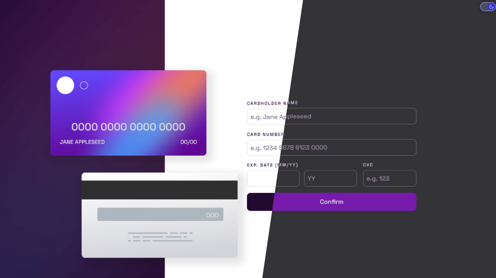

<h1 align="center">Interactive card details form</h1>

<div align="center">
  <h3>
    <a href="https://interactive-card-alamin.netlify.app/">
      🚀 Live Site
    </a>
    |
    <a href="">
      💡 Solution
    </a>
  </h5>
</div>

<p align="center">
  This project is a responsive and interactive card details form developed as a practice project from Frontend Mentor. It allows users to input their card details and see real-time updates on the card image, with error message handling and interactive states for optimal user experience.
</p>

<a align="center" href="https://interactive-card-alamin.netlify.app/">


</a>

## The challenge

Users should be able to:

- Fill in the form and see the card details update in real-time
- Receive error messages when the form is submitted if:
  - Any input field is empty
  - The card number, expiry date, or CVC fields are in the wrong format
- View the optimal layout depending on their device's screen size
- See hover, active, and focus states for interactive elements on the page
- **Bonus:** Dark mode toggle

## Built with

- Semantic HTML5 markup
- CSS custom properties
- JavaScript
- Mobile-first workflow
- NPM
- [Webpack](https://webpack.js.org/)

## What I learned

In this project, I utilized my skills in JavaScript and DOM manipulation to build a responsive and intuitive credit card form. I used Webpack to bundle my assets and optimized the build process using plugins like MiniCssExtractPlugin and HtmlWebpackPlugin.

To improve the user experience, I implemented custom error messages and a "complete" screen that appears after the form is successfully submitted. I created real-time validation and feedback for the user by applying my knowledge of JavaScript. I also included a dark mode toggle and utilized localStorage to store the user's preferred theme.

Overall, this project provided me with valuable experience in building interactive web applications and utilizing various front-end technologies to improve the user experience.

## Installation

- Clone this repo:

```sh
git clone https://github.com/CodePapa360/Interactive-Card-details-form.git
```

- Install dependencies:

```sh
npm install
```

- Build command:

```sh
npm run build
```

- Live server:

```sh
npm start
```

## Author

<b>👤 Alamin</b>

- Twitter - [@CodePapa360](https://www.twitter.com/CodePapa360)
- LinkedIn - [@CodePapa360](https://www.linkedin.com/in/codepapa360)
- Frontend Mentor - [@CodePapa360](https://www.frontendmentor.io/profile/CodePapa360)
- Github: [@CodePapa360](https://github.com/codepapa360)

Feel free to contact me with any questions or feedback!

## Show your support

Give a ⭐️ if you liked this project!

## Acknowledgments

Special thanks to Frontend Mentor for providing such an amazing platform to practice and improve my frontend skills. The challenges and projects available on the website were both fun and challenging, and helped me learn a lot in a short amount of time.

## License

This project is licensed under the [MIT](https://github.com/CodePapa360/Interactive-Card-details-form/blob/main/LICENSE.md) license, which means you can use, modify, and distribute the code as you wish. If you have any questions or feedback, feel free to reach out. Thank you for considering my code!
